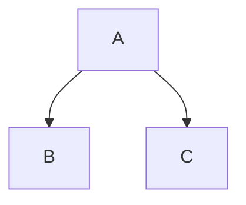

# Heading Examples 
## Heading 2
### Heading 3
#### Heading 4
##### Heading 5
###### Heading 6


# Text Formatting examples

__Bold__

_Italics_

~~strikethrough~~

Inline Code: `code` 

# Lists
## Unordered Lists:
- Item 1
- Item 2
    - subitem 2.1
    - Subitem 2.2
* Item 3 (alternative syntax)
## Ordered Lists: 
1. First Item
2. Second Item
    1. Subitem 2.1
    2. Subitem 2.2

# Links
[Link text](https://tyler.ag)

[Link with title](https://tyler.ag "Tyler's Portfolio")

[Relative link to file](./Quantum.md)

[Internal link to section](#code-examples)

[Tyler's Portfolio](https://tyler.ag)


# Images


# Code Examples

- Inline Code: `print("Hello")`
- Fenced Code Blocks:
```python
def hello():
    print("Hello, World!")
```

# Blockquotes

> This is a blockquote.  
> It can span multiple lines.  
>> Nested blockquote.


# Horizontal Rules
---
***
___

# Paragraphs and Line Breaks
- Paragraphs are created by leaving a blank line between text blocks.
- Line Breaks within a paragraph require two spaces at the end of a line or a single `\`.

This is a paragraph.\
This is another paragraph.

Line one.  
Line two (forced break)


# Math Examples

$$ E = mc^2 $$

Inline: $a^2 + b^2 = c^2$


# Table Examples

| Name | Age | Sex |
|------|-----|-----|
| Tyler | 32 | Male |
| Rose | 35 | Female |


# Task lists Examples 
- [x] Completed task
- [ ] Incomplete task
- [ ] another task


# Footnotes 

Here is some text [^1] .

[^1]: This is the footnote content.

# Definition Lists 

Term 1
: Definition for Term 1.

Term 2
: Definition for Term 2.


# Emoji  

:smile: :rocket:

https://tyler.ag


# Escaping Characters  
\*Not Bold\* instead of **Bold**

# Diagrams 



# Custom HTML:

<div style="color: hotpink; font-size: 32px; font-family: 'Arial', 'Helvetica', sans-serif;">Custom text</div>

# Admonitions/Callouts 
> [!NOTE]
> This is a note. 

Infinity can be written as ~ or oo.

```python
float('inf')
```
Inline: $-\infty$ to $+\infty$  
Display: $$-\infty$$ $$to$$ $$+\infty$$


