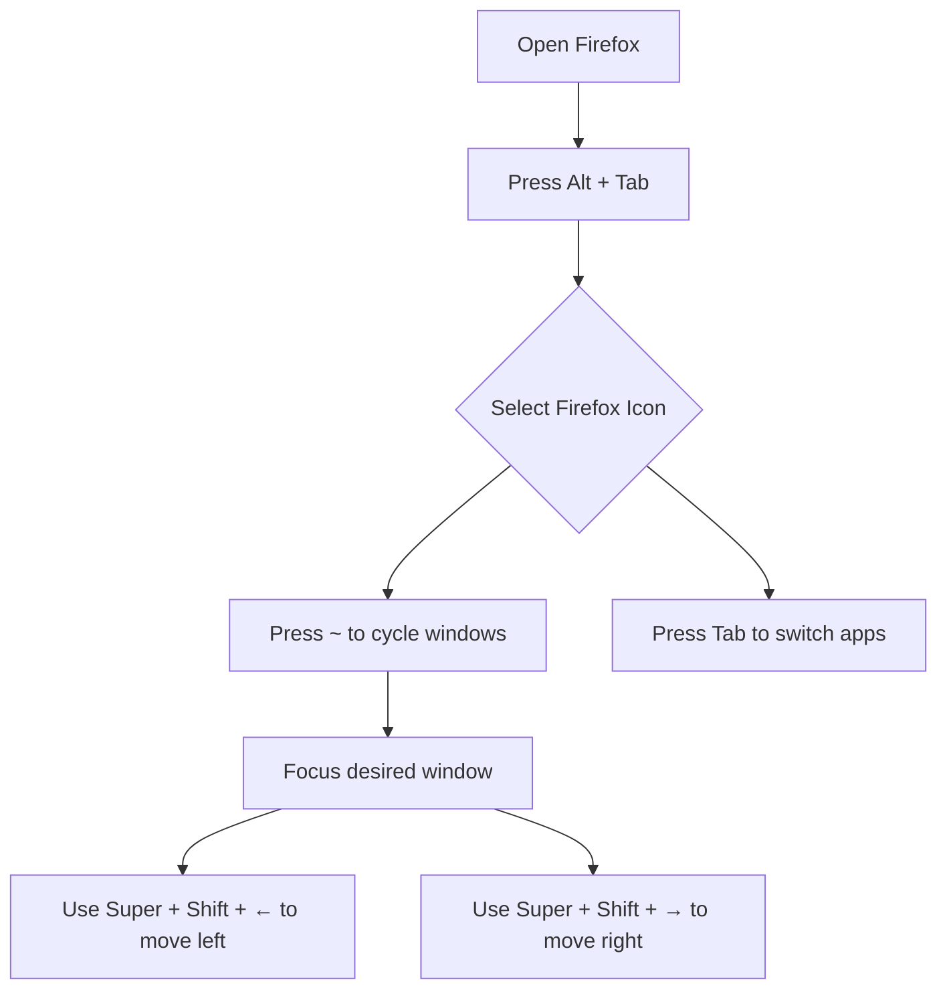

<!--
---
title: How to Markdown
date: 2025-09-14
---
-->


# Heading Examples 
## Heading 2
### Heading 3
#### Heading 4
##### Heading 5
###### Heading 6


# Text Formatting examples

__Bold__

_Italics_

~~strikethrough~~

Inline Code: `code` 

# Lists
## Unordered Lists:
- Item 1
- Item 2
    - subitem 2.1
    - Subitem 2.2
* Item 3 (alternative syntax)
## Ordered Lists: 
1. First Item
2. Second Item
    1. Subitem 2.1
    2. Subitem 2.2

# Links
[Link text](https://tyler.ag)

[Link with title](https://tyler.ag "Tyler's Portfolio")

[Relative link to file](./Quantum.md)

[Internal link to section](#code-examples)

[Tyler's Portfolio](https://tyler.ag)


# Images


# Code Examples

- Inline Code: `print("Hello")`
- Fenced Code Blocks:
```python
def hello():
    print("Hello, World!")
```

# Blockquotes

> This is a blockquote.  
> It can span multiple lines.  
>> Nested blockquote.


# Horizontal Rules
---
***
___

# Paragraphs and Line Breaks
- Paragraphs are created by leaving a blank line between text blocks.
- Line Breaks within a paragraph require two spaces at the end of a line or a single `\`.

This is a paragraph.\
This is another paragraph.

Line one.  
Line two (forced break)


# Math Examples

$$ E = mc^2 $$

Inline: $a^2 + b^2 = c^2$


# Table Examples

| Name | Age | Sex |
|------|-----|-----|
| Tyler | 32 | Male |
| Rose | 35 | Female |


# Task lists Examples 
- [x] Completed task
- [ ] Incomplete task
- [ ] another task


# Footnotes 

Here is some text [^1] .

[^1]: This is the footnote content.

# Definition Lists 

Term 1
: Definition for Term 1.

Term 2
: Definition for Term 2.


# Emoji  

👁️ ❤️ 🚀 👨‍🔬

https://tyler.ag


# Escaping Characters  
\*Not Bold\* instead of **Bold**

# Diagrams 



# Custom HTML:


<div id="customText">Custom text</div>

<div style="background-color: #e7f3fe; border-left: 6px solid #2196F3; padding: 10px;">
<strong>Note:</strong> This is a custom-styled note using HTML.
</div>

# Admonitions/Callouts 
> [!NOTE]
> This is a note.

> [!TIP]
> Try using `Ctrl + L` to focus the Firefox URL bar quickly

> [!WARNING]
> Dry ice can cause frostbite if touched without gloves.

> [!DANGER]
> Never store dry ice in an airtight container; it may explode due to CO2 buildup.

> [!INFO]
> Markdown files typically use the `.md` extension.

> [!SUCCESS]
> Your cooler is now prepped with dry ice and ready for use!

> [!QUESTION]
> How do I move a window to another screen in Ubuntu?

> [!ABSTRACT]
> Markdown supports headings, lists, code, amd more for simple formatting.

> [!BUG]
> Firefox may not have a direct shortcut for closing Picture-in-Picture windows.

> [!EXAMPLE]
> Here's how to use the infinity symbol: ∞ , `$\infty$` , or `&infin;`.

> [!QUOTE]
> "The Gateway Process involves Focus 10, a mid awake/body asleep state."

> [!FAILURE]
> Sealing the cooler airtight with dry ice caused pressure buidup.

> [!NOTE] Custom Title
> This note has a custom title.

> [!NOTE]+
> This note is collapsible.

> [!WARNING]
> Be cautious with dry ice.
> > [!TIP]
> > Wear insulated gloves to avoid frostbite.

> [!IDEA]
> Make an app that gives AI "hands" to do task like send emails and create reminders.

> [!TODO]
> Finish all my projects.

:::note
This is a note.
:::

::: warning
This is a warning.
:::


Infinity can be written as ~ or oo.

```python
float('inf')
```
Inline: $-\infty$ $\leftarrow$ 0 $\rightarrow$ $+\infty$  
Display: $$-\infty$$ $$ $\leftarrow$ 0 $\rightarrow$ $$ $$+\infty$$


